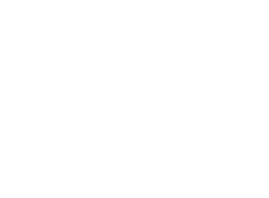

<p align="center">
  
  <br>
  <i>Shyntr - Auth Portal</i>
</p>


The **Shyntr Auth Portal** is the highly scalable, user-facing authentication interface for the Shyntr ecosystem. It handles the core identity flows including Login, User Consent, and Logout routing for the Zero Trust Identity Broker.

## Password Verifier Configuration

Password login uses an external verifier endpoint returned by Shyntr as the password method `login_url`.

The Auth Portal enforces strict outbound allowlisting before it will call that verifier. Outbound password-verifier requests are allowed only when the verifier origin matches one of:

* `SHYNTR_INTERNAL_API_URL`
* `SHYNTR_PUBLIC_API_URL`
* `SHYNTR_AUTH_ALLOWED_ORIGINS`

If the verifier origin is not allowlisted, the portal blocks the request, never calls the verifier, and password login fails with `login_failed`.

`SHYNTR_AUTH_ALLOWED_ORIGINS` is optional and accepts a comma-separated list of exact origins. Only exact `http` or `https` origin matches are accepted. Wildcards are not supported. Invalid entries are ignored.

Example:

```env
SHYNTR_AUTH_ALLOWED_ORIGINS=http://localhost:7499
```

Restart the Auth Portal after changing environment variables. If the verifier origin is not configured, password login fails with `login_failed`.

## ✨ Features
* **Custom Authentication UI:** A frictionless and secure login experience.
* **Consent Management:** Granular OAuth2/OIDC scope approval screens.
* **Protocol Agnostic:** Works seamlessly with the Shyntr Go Backend for cross-protocol (SAML/OIDC) identity flows.
* **High Performance:** Server-Side Rendered (SSR) using Next.js App Router for optimal load times and LCP.

## 🚀 Tech Stack
* **Framework:** Next.js (App Router)
* **Styling:** Tailwind CSS, Shadcn UI components
* **Package Manager:** Yarn (v1.22.x)
* **Deployment:** Docker (Next.js Standalone Mode)

## 🛠️ Getting Started (Local Development)

### Prerequisites
* Node.js v22.x
* Yarn v1.22.x

### Installation
1. Clone the repository:
   ```bash
   git clone [https://github.com/shyntr/shyntr-auth-portal.git](https://github.com/shyntr/shyntr-auth-portal.git)
   cd shyntr-auth-portal
   ```
2. Install dependencies:

    ```bash
    yarn install --frozen-lockfile
    ```
3. Start the development server:

    ```bash
    yarn dev
    ```

4. Open http://localhost:3000 in your browser.

## 🐳 Docker Production Build
The application uses the Next.js standalone output mode to drastically reduce the container image size and improve security (running as a non-root user).

```bash
# Build the image
docker build -t shyntr/shyntr-auth-portal:latest .

# Run the container
docker run -d -p 3000:3000 --name shyntr/shyntr-auth-portal shyntr/shyntr-auth-portal:latest
```

## 🔄 CI/CD Pipeline
Automated deployments are configured via GitHub Actions. Tagging a commit (e.g., git tag v1.0.0) triggers the pipeline to:

* Validate dependencies and build logic.
* Generate multi-arch Docker images (AMD64/ARM64).
* Push images to Docker Hub with intelligent SemVer tagging.
* Auto-sync this README to the Docker Hub repository page.

---

## 🤝 Contributing

We love community! 💖

Found a bug? Have a great idea? Feel free to jump in! We appreciate every piece of feedback and contribution.
Let's build the ultimate Identity Broker together! 🚀

## 📄 License

Free as in freedom! 🦅

Shyntr is proudly open-source and licensed under the **Apache-2.0** license.
Check the [LICENSE](https://github.com/Shyntr/shyntr/blob/main/LICENSE) file for the boring legal details.

---

<div>
  <a href="https://buymeacoffee.com/nevzatcirak" target="_blank">
    
  </a>
  <a href="https://nevzatcirak.com" target="_blank">
    
  </a>
</div>
<br clear="all">
